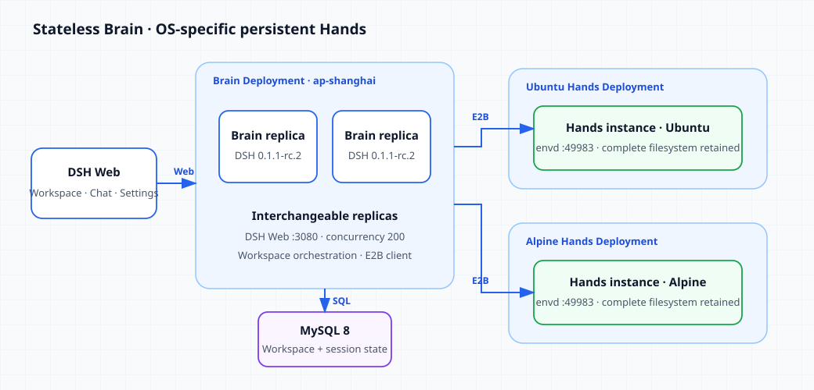

# Run stateless DeepSeek Harness Brain with persistent Hands on AGS

English | [中文](./README_zh.md)

This example splits DeepSeek Harness (DSH) into two layers. Brain serves DSH Web, inference, and orchestration. Hands executes commands. Brain can run as interchangeable stateless replicas, MySQL stores Workspace and session state, and the first Chat in each Workspace creates one exclusive Hands instance for the selected OS. Later Chats reuse that instance, whose complete filesystem is retained by AGS.



Creating a Workspace asks only for its name and OS; the UI does not expose the underlying Deployment:


This cookbook uses DSH `0.1.1-rc.2` and envd `0.6.13`. All resources run in `ap-shanghai`.

## Prerequisites

- A configured `agr` CLI.
- An Agent Runtime CAM role ARN.
- A MySQL 8 database reachable from Brain.
- Tencent Cloud credentials that can obtain access tokens for the Hands Deployments.
- An API key for an OpenAI-compatible model endpoint.

## Published images

- Brain: `ccr.ccs.tencentyun.com/ags.dev/deepseek-harness-brain:v0.1.1-rc.2-ags.4`
- Ubuntu Hands: `ccr.ccs.tencentyun.com/ags.dev/deepseek-harness-hands-ubuntu:v0.6.13`
- Alpine Hands: `ccr.ccs.tencentyun.com/ags.dev/deepseek-harness-hands-alpine:v0.6.13`

The tutorial uses these tags directly. See [BUILD.md](./BUILD.md) only when you need to change the images.

## 1. Prepare MySQL

Create the database:

```sql
CREATE DATABASE `dsh-cookbook`
  CHARACTER SET utf8mb4
  COLLATE utf8mb4_0900_ai_ci;
```

Brain applies the single migration file in this directory at startup. Every Brain replica must connect to this same database.

## 2. Create Ubuntu Hands

Set the shared values first. Resource names must be unique in the current account:

```bash
export AGR_REGION=ap-shanghai
export AGR_ROLE_ARN='qcs::cam::uin/100000000001:roleName/replace-me'
export HANDS_UBUNTU_TOOL_NAME='dsh-hands-ubuntu-your-name'
export HANDS_UBUNTU_DEPLOYMENT_NAME='dsh-hands-ubuntu-your-name'
```

Create the Ubuntu Tool:

```bash
agr tool create \
  --region "$AGR_REGION" \
  --tool-name "$HANDS_UBUNTU_TOOL_NAME" \
  --tool-type custom \
  --persistent \
  --role-arn "$AGR_ROLE_ARN" \
  --network-configuration '{"NetworkMode":"PUBLIC"}' \
  --custom-configuration '{"Image":"ccr.ccs.tencentyun.com/ags.dev/deepseek-harness-hands-ubuntu:v0.6.13","ImageRegistryType":"personal","Command":["/usr/bin/envd"],"Args":["-port","49983"],"Ports":[{"Name":"envd","Port":49983,"Protocol":"TCP"}],"Resources":{"CPU":"2000m","Memory":"4Gi"},"Probe":{"HttpGet":{"Path":"/health","Port":49983,"Scheme":"HTTP"}}}' \
  --tags '[{"Key":"cookbook","Value":"deepseek-harness-brain-hands"},{"Key":"os","Value":"ubuntu"}]' \
  --wait
```

Copy the Tool ID from the output, then create an exclusive Deployment that pauses when idle:

```bash
export HANDS_UBUNTU_TOOL_ID='sdt-replace-me'

agr deployment create \
  --region "$AGR_REGION" \
  --deployment-name "$HANDS_UBUNTU_DEPLOYMENT_NAME" \
  --tool-id "$HANDS_UBUNTU_TOOL_ID" \
  --scaling-configuration '{"MinInstanceCount":0,"MaxInstanceCount":20,"MaxInstanceRequestConcurrency":200}' \
  --lifecycle-configuration '{"IdleTimeoutSeconds":300,"IdleAction":"PAUSE"}' \
  --affinity-configuration '{"Mode":"EXCLUSIVE","HeaderName":"X-Tencent-Agr-Affinity-Id"}' \
  --tags '[{"Key":"cookbook","Value":"deepseek-harness-brain-hands"},{"Key":"os","Value":"ubuntu"}]'
```

Copy the Deployment ID:

```bash
export HANDS_UBUNTU_DEPLOYMENT_ID='dpl-replace-me'
```

## 3. Create Alpine Hands

Alpine uses its own Tool and Deployment:

```bash
export HANDS_ALPINE_TOOL_NAME='dsh-hands-alpine-your-name'
export HANDS_ALPINE_DEPLOYMENT_NAME='dsh-hands-alpine-your-name'

agr tool create \
  --region "$AGR_REGION" \
  --tool-name "$HANDS_ALPINE_TOOL_NAME" \
  --tool-type custom \
  --persistent \
  --role-arn "$AGR_ROLE_ARN" \
  --network-configuration '{"NetworkMode":"PUBLIC"}' \
  --custom-configuration '{"Image":"ccr.ccs.tencentyun.com/ags.dev/deepseek-harness-hands-alpine:v0.6.13","ImageRegistryType":"personal","Command":["/usr/bin/envd"],"Args":["-port","49983"],"Ports":[{"Name":"envd","Port":49983,"Protocol":"TCP"}],"Resources":{"CPU":"2000m","Memory":"4Gi"},"Probe":{"HttpGet":{"Path":"/health","Port":49983,"Scheme":"HTTP"}}}' \
  --tags '[{"Key":"cookbook","Value":"deepseek-harness-brain-hands"},{"Key":"os","Value":"alpine"}]' \
  --wait
```

```bash
export HANDS_ALPINE_TOOL_ID='sdt-replace-me'

agr deployment create \
  --region "$AGR_REGION" \
  --deployment-name "$HANDS_ALPINE_DEPLOYMENT_NAME" \
  --tool-id "$HANDS_ALPINE_TOOL_ID" \
  --scaling-configuration '{"MinInstanceCount":0,"MaxInstanceCount":20,"MaxInstanceRequestConcurrency":200}' \
  --lifecycle-configuration '{"IdleTimeoutSeconds":300,"IdleAction":"PAUSE"}' \
  --affinity-configuration '{"Mode":"EXCLUSIVE","HeaderName":"X-Tencent-Agr-Affinity-Id"}' \
  --tags '[{"Key":"cookbook","Value":"deepseek-harness-brain-hands"},{"Key":"os","Value":"alpine"}]'
```

Copy the Deployment ID:

```bash
export HANDS_ALPINE_DEPLOYMENT_ID='dpl-replace-me'
```

## 4. Create stateless Brain

`HANDS_OS_DEPLOYMENTS` maps the OS labels shown in the UI to the two Hands Deployments. Replace the database, Deployment, Tencent Cloud, and model values in the JSON below:

```bash
export BRAIN_TOOL_NAME='dsh-brain-your-name'
export BRAIN_DEPLOYMENT_NAME='dsh-brain-your-name'

agr tool create \
  --region "$AGR_REGION" \
  --tool-name "$BRAIN_TOOL_NAME" \
  --tool-type custom \
  --persistent \
  --role-arn "$AGR_ROLE_ARN" \
  --network-configuration '{"NetworkMode":"PUBLIC"}' \
  --custom-configuration '{"Image":"ccr.ccs.tencentyun.com/ags.dev/deepseek-harness-brain:v0.1.1-rc.2-ags.4","ImageRegistryType":"personal","Command":["node","/app/dist/brain/launcher.js"],"Env":[{"Name":"MYSQL_HOST","Value":"mysql.example.com"},{"Name":"MYSQL_PORT","Value":"3306"},{"Name":"MYSQL_USER","Value":"dsh_brain"},{"Name":"MYSQL_PASSWORD","Value":"replace-me"},{"Name":"MYSQL_DATABASE","Value":"dsh-cookbook"},{"Name":"AGS_REGION","Value":"ap-shanghai"},{"Name":"HANDS_OS_DEPLOYMENTS","Value":"ubuntu=dpl-replace-ubuntu,alpine=dpl-replace-alpine"},{"Name":"TENCENTCLOUD_SECRET_ID","Value":"replace-me"},{"Name":"TENCENTCLOUD_SECRET_KEY","Value":"replace-me"},{"Name":"TOKENHUB_API_KEY","Value":"replace-me"},{"Name":"TOKENHUB_BASE_URL","Value":"https://tokenhub.tencentmaas.com/v1"},{"Name":"TOKENHUB_MODEL","Value":"deepseek-v4-flash"}],"Ports":[{"Name":"http","Port":8080,"Protocol":"TCP"},{"Name":"web","Port":3080,"Protocol":"TCP"}],"Resources":{"CPU":"2000m","Memory":"4Gi"},"Probe":{"HttpGet":{"Path":"/readyz","Port":8080,"Scheme":"HTTP"}}}' \
  --tags '[{"Key":"cookbook","Value":"deepseek-harness-brain-hands"},{"Key":"component","Value":"brain"}]' \
  --wait
```

Copy the Brain Tool ID and create a non-affine, multi-replica Deployment:

```bash
export BRAIN_TOOL_ID='sdt-replace-me'

agr deployment create \
  --region "$AGR_REGION" \
  --deployment-name "$BRAIN_DEPLOYMENT_NAME" \
  --tool-id "$BRAIN_TOOL_ID" \
  --scaling-configuration '{"MinInstanceCount":2,"MaxInstanceCount":4,"MaxInstanceRequestConcurrency":200}' \
  --lifecycle-configuration '{"IdleTimeoutSeconds":300,"IdleAction":"STOP"}' \
  --tags '[{"Key":"cookbook","Value":"deepseek-harness-brain-hands"},{"Key":"component","Value":"brain"}]'
```

Copy the Brain Deployment ID from the output:

```bash
export BRAIN_DEPLOYMENT_ID='dpl-replace-me'
```

MySQL owns the shared state, so Brain needs no affinity and any replica can serve a request.

## 5. Open DSH Web

Choose a running Brain instance and proxy its Web port:

```bash
agr instance list --tool-id "$BRAIN_TOOL_ID" --region "$AGR_REGION"
export BRAIN_INSTANCE_ID='replace-with-running-instance-id'
agr instance proxy "$BRAIN_INSTANCE_ID" 18082:3080 --region "$AGR_REGION"
```

Open <http://127.0.0.1:18082> and work entirely in DSH Web:

1. Click **Add workspace**.
2. Enter a Workspace name and choose **Ubuntu** or **Alpine**.
3. Click **Create**. This stores the Workspace without creating Hands yet.
4. Start the first Chat in that Workspace. Brain creates Hands for the selected OS and stores its affinity ID.
5. Continue chatting in the Workspace. Every command uses that same Hands instance and its complete filesystem.

General, Models, Plugins, Agent presets, and the other Settings pages use this same instance proxy.

## 6. Clean up

Delete the Brain Deployment and both Hands Deployments first. After their instances are gone, delete the three Tools:

```bash
agr deployment delete "$BRAIN_DEPLOYMENT_ID" --region "$AGR_REGION" --wait
agr deployment delete "$HANDS_UBUNTU_DEPLOYMENT_ID" --region "$AGR_REGION" --wait
agr deployment delete "$HANDS_ALPINE_DEPLOYMENT_ID" --region "$AGR_REGION" --wait
```

```bash
agr tool delete "$BRAIN_TOOL_ID" --region "$AGR_REGION" --yes --wait
agr tool delete "$HANDS_UBUNTU_TOOL_ID" --region "$AGR_REGION" --yes --wait
agr tool delete "$HANDS_ALPINE_TOOL_ID" --region "$AGR_REGION" --yes --wait
```
