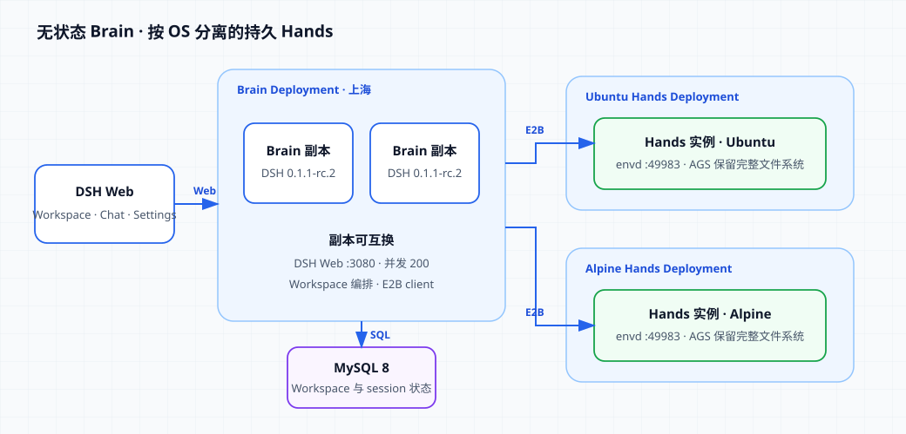
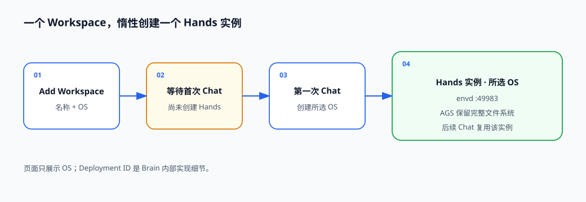

# 在 AGS 上运行无状态 DeepSeek Harness Brain 与持久 Hands

[English](./README.md) | 中文

本示例把 DeepSeek Harness（DSH）拆成两层：Brain 负责 DSH Web、推理与状态编排，Hands 负责命令执行。Brain 可以运行多个无状态副本；MySQL 保存 Workspace 与 session 状态；每个 Workspace 在第一次 Chat 时按所选 OS 创建一个独占 Hands 实例，后续 Chat 继续使用同一个实例。AGS 会保留 Hands 实例的完整文件系统。



Workspace 的创建过程只要求名称和 OS，页面不会暴露底层 Deployment：



本 cookbook 使用 DSH `0.1.1-rc.2` 和 envd `0.6.13`，所有资源均部署在 `ap-shanghai`。

## 前置条件

- 已安装并配置 `agr`。
- 一个 Agent Runtime CAM 角色 ARN。
- Brain 能连接的 MySQL 8 数据库。
- 可为 Hands Deployment 获取访问 Token 的腾讯云凭证。
- 可调用 OpenAI 兼容模型接口的 API Key。

## 已发布镜像

- Brain：`ccr.ccs.tencentyun.com/ags.dev/deepseek-harness-brain:v0.1.1-rc.2-ags.4`
- Ubuntu Hands：`ccr.ccs.tencentyun.com/ags.dev/deepseek-harness-hands-ubuntu:v0.6.13`
- Alpine Hands：`ccr.ccs.tencentyun.com/ags.dev/deepseek-harness-hands-alpine:v0.6.13`

教程直接使用这些 tag。需要修改镜像时再参考 [BUILD_zh.md](./BUILD_zh.md)。

## 1. 准备 MySQL

创建数据库：

```sql
CREATE DATABASE `dsh-cookbook`
  CHARACTER SET utf8mb4
  COLLATE utf8mb4_0900_ai_ci;
```

Brain 启动时会自动执行目录中的单个 migration 文件并初始化表结构。所有 Brain 副本必须连接同一个数据库。

## 2. 创建 Ubuntu Hands

先设置公共参数。资源名称在当前账号内必须唯一：

```bash
export AGR_REGION=ap-shanghai
export AGR_ROLE_ARN='qcs::cam::uin/100000000001:roleName/replace-me'
export HANDS_UBUNTU_TOOL_NAME='dsh-hands-ubuntu-your-name'
export HANDS_UBUNTU_DEPLOYMENT_NAME='dsh-hands-ubuntu-your-name'
```

创建 Ubuntu Tool：

```bash
agr tool create \
  --region "$AGR_REGION" \
  --tool-name "$HANDS_UBUNTU_TOOL_NAME" \
  --tool-type custom \
  --persistent \
  --role-arn "$AGR_ROLE_ARN" \
  --network-configuration '{"NetworkMode":"PUBLIC"}' \
  --custom-configuration '{"Image":"ccr.ccs.tencentyun.com/ags.dev/deepseek-harness-hands-ubuntu:v0.6.13","ImageRegistryType":"personal","Command":["/usr/bin/envd"],"Args":["-port","49983"],"Ports":[{"Name":"envd","Port":49983,"Protocol":"TCP"}],"Resources":{"CPU":"2000m","Memory":"4Gi"},"Probe":{"HttpGet":{"Path":"/health","Port":49983,"Scheme":"HTTP"}}}' \
  --tags '[{"Key":"cookbook","Value":"deepseek-harness-brain-hands"},{"Key":"os","Value":"ubuntu"}]' \
  --wait
```

复制输出中的 Tool ID，然后创建独占、空闲暂停的 Deployment：

```bash
export HANDS_UBUNTU_TOOL_ID='sdt-replace-me'

agr deployment create \
  --region "$AGR_REGION" \
  --deployment-name "$HANDS_UBUNTU_DEPLOYMENT_NAME" \
  --tool-id "$HANDS_UBUNTU_TOOL_ID" \
  --scaling-configuration '{"MinInstanceCount":0,"MaxInstanceCount":20,"MaxInstanceRequestConcurrency":200}' \
  --lifecycle-configuration '{"IdleTimeoutSeconds":300,"IdleAction":"PAUSE"}' \
  --affinity-configuration '{"Mode":"EXCLUSIVE","HeaderName":"X-Tencent-Agr-Affinity-Id"}' \
  --tags '[{"Key":"cookbook","Value":"deepseek-harness-brain-hands"},{"Key":"os","Value":"ubuntu"}]'
```

复制输出中的 Deployment ID：

```bash
export HANDS_UBUNTU_DEPLOYMENT_ID='dpl-replace-me'
```

## 3. 创建 Alpine Hands

Alpine 使用独立的 Tool 和 Deployment：

```bash
export HANDS_ALPINE_TOOL_NAME='dsh-hands-alpine-your-name'
export HANDS_ALPINE_DEPLOYMENT_NAME='dsh-hands-alpine-your-name'

agr tool create \
  --region "$AGR_REGION" \
  --tool-name "$HANDS_ALPINE_TOOL_NAME" \
  --tool-type custom \
  --persistent \
  --role-arn "$AGR_ROLE_ARN" \
  --network-configuration '{"NetworkMode":"PUBLIC"}' \
  --custom-configuration '{"Image":"ccr.ccs.tencentyun.com/ags.dev/deepseek-harness-hands-alpine:v0.6.13","ImageRegistryType":"personal","Command":["/usr/bin/envd"],"Args":["-port","49983"],"Ports":[{"Name":"envd","Port":49983,"Protocol":"TCP"}],"Resources":{"CPU":"2000m","Memory":"4Gi"},"Probe":{"HttpGet":{"Path":"/health","Port":49983,"Scheme":"HTTP"}}}' \
  --tags '[{"Key":"cookbook","Value":"deepseek-harness-brain-hands"},{"Key":"os","Value":"alpine"}]' \
  --wait
```

```bash
export HANDS_ALPINE_TOOL_ID='sdt-replace-me'

agr deployment create \
  --region "$AGR_REGION" \
  --deployment-name "$HANDS_ALPINE_DEPLOYMENT_NAME" \
  --tool-id "$HANDS_ALPINE_TOOL_ID" \
  --scaling-configuration '{"MinInstanceCount":0,"MaxInstanceCount":20,"MaxInstanceRequestConcurrency":200}' \
  --lifecycle-configuration '{"IdleTimeoutSeconds":300,"IdleAction":"PAUSE"}' \
  --affinity-configuration '{"Mode":"EXCLUSIVE","HeaderName":"X-Tencent-Agr-Affinity-Id"}' \
  --tags '[{"Key":"cookbook","Value":"deepseek-harness-brain-hands"},{"Key":"os","Value":"alpine"}]'
```

复制输出中的 Deployment ID：

```bash
export HANDS_ALPINE_DEPLOYMENT_ID='dpl-replace-me'
```

## 4. 创建无状态 Brain

Brain Tool 中的 `HANDS_OS_DEPLOYMENTS` 把页面显示的 OS 映射到两个 Hands Deployment。替换 JSON 中的数据库、Deployment、腾讯云和模型参数：

```bash
export BRAIN_TOOL_NAME='dsh-brain-your-name'
export BRAIN_DEPLOYMENT_NAME='dsh-brain-your-name'

agr tool create \
  --region "$AGR_REGION" \
  --tool-name "$BRAIN_TOOL_NAME" \
  --tool-type custom \
  --persistent \
  --role-arn "$AGR_ROLE_ARN" \
  --network-configuration '{"NetworkMode":"PUBLIC"}' \
  --custom-configuration '{"Image":"ccr.ccs.tencentyun.com/ags.dev/deepseek-harness-brain:v0.1.1-rc.2-ags.4","ImageRegistryType":"personal","Command":["node","/app/dist/brain/launcher.js"],"Env":[{"Name":"MYSQL_HOST","Value":"mysql.example.com"},{"Name":"MYSQL_PORT","Value":"3306"},{"Name":"MYSQL_USER","Value":"dsh_brain"},{"Name":"MYSQL_PASSWORD","Value":"replace-me"},{"Name":"MYSQL_DATABASE","Value":"dsh-cookbook"},{"Name":"AGS_REGION","Value":"ap-shanghai"},{"Name":"HANDS_OS_DEPLOYMENTS","Value":"ubuntu=dpl-replace-ubuntu,alpine=dpl-replace-alpine"},{"Name":"TENCENTCLOUD_SECRET_ID","Value":"replace-me"},{"Name":"TENCENTCLOUD_SECRET_KEY","Value":"replace-me"},{"Name":"TOKENHUB_API_KEY","Value":"replace-me"},{"Name":"TOKENHUB_BASE_URL","Value":"https://tokenhub.tencentmaas.com/v1"},{"Name":"TOKENHUB_MODEL","Value":"deepseek-v4-flash"}],"Ports":[{"Name":"http","Port":8080,"Protocol":"TCP"},{"Name":"web","Port":3080,"Protocol":"TCP"}],"Resources":{"CPU":"2000m","Memory":"4Gi"},"Probe":{"HttpGet":{"Path":"/readyz","Port":8080,"Scheme":"HTTP"}}}' \
  --tags '[{"Key":"cookbook","Value":"deepseek-harness-brain-hands"},{"Key":"component","Value":"brain"}]' \
  --wait
```

复制 Brain Tool ID，然后创建不带 affinity 的多副本 Deployment：

```bash
export BRAIN_TOOL_ID='sdt-replace-me'

agr deployment create \
  --region "$AGR_REGION" \
  --deployment-name "$BRAIN_DEPLOYMENT_NAME" \
  --tool-id "$BRAIN_TOOL_ID" \
  --scaling-configuration '{"MinInstanceCount":2,"MaxInstanceCount":4,"MaxInstanceRequestConcurrency":200}' \
  --lifecycle-configuration '{"IdleTimeoutSeconds":300,"IdleAction":"STOP"}' \
  --tags '[{"Key":"cookbook","Value":"deepseek-harness-brain-hands"},{"Key":"component","Value":"brain"}]'
```

复制输出中的 Brain Deployment ID：

```bash
export BRAIN_DEPLOYMENT_ID='dpl-replace-me'
```

MySQL 保存共享状态，因此 Brain 不需要 affinity，任意副本都可以处理请求。

## 5. 打开 DSH Web

查询一个正在运行的 Brain 实例，并代理它的 Web 端口：

```bash
agr instance list --tool-id "$BRAIN_TOOL_ID" --region "$AGR_REGION"
export BRAIN_INSTANCE_ID='replace-with-running-instance-id'
agr instance proxy "$BRAIN_INSTANCE_ID" 18082:3080 --region "$AGR_REGION"
```

打开 <http://127.0.0.1:18082>，直接在 DSH Web 中操作：

1. 点击 **Add workspace**。
2. 输入 Workspace 名称并选择 **Ubuntu** 或 **Alpine**。
3. 点击 **Create**。此时只保存 Workspace，尚未创建 Hands。
4. 在该 Workspace 中发起第一次 Chat。Brain 会创建所选 OS 的 Hands，并保存 affinity ID。
5. 继续在该 Workspace 中 Chat；所有命令都在同一个 Hands 实例与同一套完整文件系统中执行。

General、Models、Plugins 和 Agent presets 等 Settings 页面也通过同一个 instance proxy 使用。

## 6. 清理资源

先删除 Brain Deployment，再删除两个 Hands Deployment；确认关联实例已删除后，最后删除三个 Tool：

```bash
agr deployment delete "$BRAIN_DEPLOYMENT_ID" --region "$AGR_REGION" --wait
agr deployment delete "$HANDS_UBUNTU_DEPLOYMENT_ID" --region "$AGR_REGION" --wait
agr deployment delete "$HANDS_ALPINE_DEPLOYMENT_ID" --region "$AGR_REGION" --wait
```

```bash
agr tool delete "$BRAIN_TOOL_ID" --region "$AGR_REGION" --yes --wait
agr tool delete "$HANDS_UBUNTU_TOOL_ID" --region "$AGR_REGION" --yes --wait
agr tool delete "$HANDS_ALPINE_TOOL_ID" --region "$AGR_REGION" --yes --wait
```
